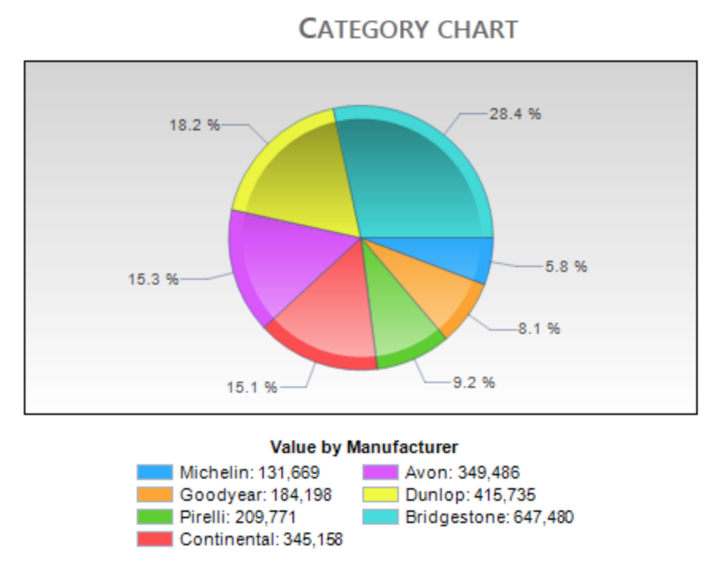
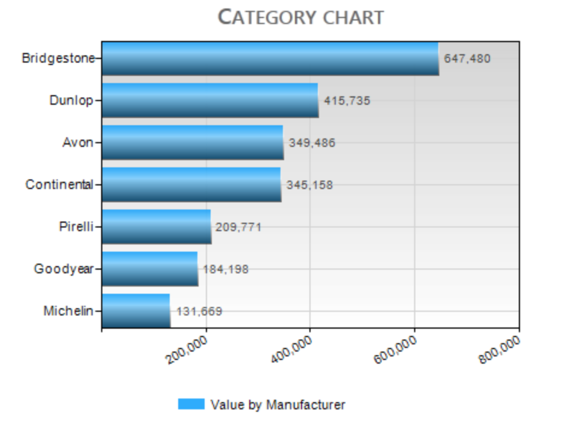
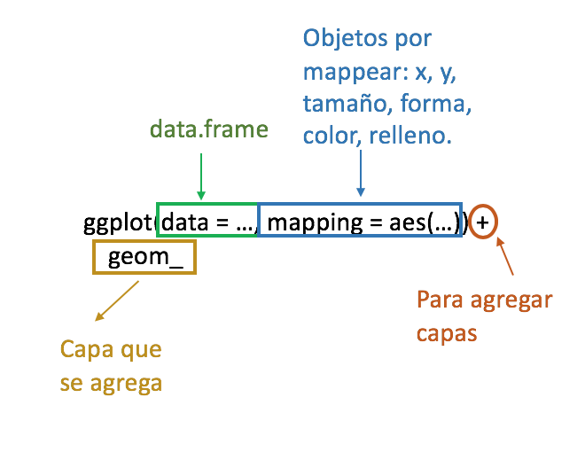

```{r setup, include=FALSE}
library(learnr)
library(magrittr)
library(dplyr)
library(ggplot2)
library(gridExtra)
library(ggcorrplot)
library(ggalt)
library(ggExtra)
library(ggthemes)
library(ggdendro)
library(treemapify)
library(ggpol)
knitr::opts_chunk$set(echo = TRUE)
```


## Introducción

> "No hay ninguna herramienta estadística que sea más poderosa que una gráfica bien elegida."         
Tukey, Chambers, Cleveland & Kleiner 

### ¿Por qué gráficar?

- No es suficiente la información estadística que se tiene de los datos.
- Un mayor entendimiento del conjunto de datos.
- Resolver preguntas de investigación.

Una buena visualización puede mostrar cosas que no se esperaban, generar nuevas preguntas o ampliar el conocimiento de los datos. Incluso ayuda a verificar si la pregunta inicial de investigación es la correcta. 

> "La excelencia en la gráficas estadísticas consiste en comunicar claramente ideas complejas."          Tufte

La comunicación de la gráfica debe mostrar la verdad de los datos, ya que varias veces la información puede ser usada para dar un mensaje diferente (intencionalmente) al que debería dar.

**Ejemplos**

> "Lo único peor que una gráfica de pie, son varias de ellas."                                     Tufte

Las gráficas de pie o pastel no son muy buenas comunicando el mensaje que se quiere dar. Pues no es claro diferenciar la información cuando se tienen varias categorías o valores similares. 

Además, el uso de efectos 3D no proporciona información adicional a una gráfica. En ocasiones, puede distorcionar la diferencia entre magnitudes de las categorías.

<center>
{width=50%}
</center>

<center>
{width=50%}
</center>

Las gráficas que se muestran a continuación son más sencillas y logran representar la información de manera clara.

```{r, echo=FALSE, warning=FALSE, message=FALSE}
library(tidyverse)
library(ggplot2)
require(scales)
library(gridExtra)

base <- data.frame(Manufacturer = c("Bridgestone", "Dunlop", "Avon", "Continental", "Pirelli", "Goodyear", "Michelin"), Value = c(647480, 415735, 349486, 345158, 209771, 184198, 131669)) %>% 
  arrange(Value) %>% 
  mutate(Manufacturer = factor(Manufacturer, levels = Manufacturer))

g1 <- ggplot(base, aes(x = Manufacturer, y = Value, fill = Manufacturer)) +
  geom_bar(stat = "identity") +
  scale_y_continuous(labels = comma) +
  theme_bw() +
  coord_flip() +
  theme(legend.position = "None") +
  labs(title = "Frecuencia")

g2 <- base %>% 
  mutate(n = sum(Value),
         porc = round(100 * Value/n, 2)) %>% 
  ggplot(aes(x = Manufacturer, y = porc, fill = Manufacturer)) +
  geom_bar(stat = "identity") +
  theme_bw() +
  coord_flip() +
  theme(legend.position = "None") +
  labs(y = "%", title = "Proporciones")

grid.arrange(g1, g2, nrow = 1)
```

Es importante que cuando se realiza una gráfica el eje vertical empiece en cero.

Las gráficas de la izquierda (simuladas) confunden al lector con la diferencia de alturas entre las barras, por no empezar el eje en cero. Las gráficas correctas son las de la derecha.

<center>
{width=50%}
</center>

En las gráficas con imágenes es importante la escala que se le da a las mismas, pues la interpretación puede ser engañosa. En la siguiente imagen se observa que Burger King es casi 3 veces más grande que Starbucks y la escala de sus imágenes no muestra esa diferencia.

<center>
{width=70%}
</center>

Las gráficas con dos ejes verticales pueden ocasionar lecturas incorrectas. Pues al no estar en la misma escala, un aumento o disminución de las variables pueden parecer de la misma magnitud cuando realmente no lo son. 

<center>
{width=50%}

## ggplot2

```{r eval=FALSE, echo=TRUE}
install.packages("ggplot2")
library(ggplot2)
```

`ggplot2` es un paquete para generar gráficas. En él se construye la gráfica agregando diferentes capas (`layers`). Se puede comenzar por una capa mostrando los datos en crudo e ir añadiendo mas capas con anotaciones y resúmenes estadísticos.

### ¿Cómo funciona?

Se incluye un conjunto de datos (`data.frame`) y un conjunto de objetos geométricos `geom_` en un sistema de coordenadas (x,y).

<center>
{width=50%}
{width=50%}
</center>

Los tipos de capas que se utilizan en este curso son:

1. Aesthetic: `aes()` propiedades de objetos por mapear en la gráfica (axis x, axis y, size, shape, color, fill).

2. Geoms: `geom_` Objetos geométricos. Estos objetos se dividen en objetos que mapean en una dimensión, dos dimensiones y tres dimensiones.

3. Facets: `facet_` División de gráficas en diferentes paneles o subgráficas.

<center>
{width=50%}
</center>

Otro tipo de capas es `theme_` y `labs` que sirven para dar formato a nuestra gráfica.

## Diagramas de dispersión

Los diagramas de dispersión son gráficas que nos ayudan a entender la relación entre dos medidas o valores observados *x* y *y*. 

Para esta sección se usará la base de datos `mpg` (se carga con el paquete `ggplot2`), que contiene información de la economía del combustible para 38 modelos de autos.

```{r, echo=TRUE}
head(mpg)
summary(mpg)
str(mpg)

```

Si pedimos ayuda de `?mpg`, podemos ver una descripción más detallada de las variables.


La función `ggplot` tiene como argumentos:

  - `data`: los datos en donde está la información que queremos graficar, 
  - `mapping`: las variables (columnas) que van a graficarse en cada eje, se declaran 
  dentro de `aes()`
  
Después de indicar estos argumentos, tenemos que agregar la capa que nos dice 
qué tipo de gráfica va a representar nuestros datos. Usamos `geom_point`
al tratarse de una gráfica de dispersión.
  

**Ejemplo:**

```{r grafica1}
ggplot(data = mpg, aes(x = displ, y = hwy)) +
  geom_point()
```

Cuando queremos que la gráfica tenga algún color en particular (que no esté relacionado
con alguna variable), podemos especificarlo en la capa en donde se indica el tipo de gráfica con el argumento `color`.


```{r grafica2}
ggplot(data = mpg, aes(x = displ, y = hwy)) +
  geom_point(color = "red")
```


¿Qué pasa si especificamos el color dentro de `aes`?
`ggplot` lo toma como si se tratara de una variable.


```{r grafica2_2}
ggplot(data = mpg, aes(x = displ, y = hwy, color = 'green')) +
  geom_point()
```


<br/>

<style>
div.blue { background-color:#e6f0ff; border-radius: 5px; padding: 20px;}
</style>
<div class = "blue">


**_Nota:_** El color lo podemos indicar ya sea con el nombre del color entre
comillas o bien indicando el código hexadecimal también entre comillas, como se
verá más adelante.

</div>

<br/>


También podemos espeficar el tamaño y la forma que queremos que tengan los puntos con 
los argumentos `size` y `shape`, respectivamente.

```{r grafica3}
ggplot(data = mpg, aes(x = displ, y = hwy)) +
  geom_point(size = 3, shape = 1)
```

A continuación se muestran las diferentes formas que pueden tomar los puntos
en `geom_point`.

```{r, echo = FALSE}
d <- data.frame(p = c(0:25,32:127))

ggplot() +
  scale_y_continuous(name="") +
  scale_x_continuous(name="") +
  scale_shape_identity() +
  geom_point(data=d, mapping=aes(x=p%%16, y=p%/%16, shape=p), size=5, fill="red") +
  geom_text(data=d, mapping=aes(x=p%%16, y=p%/%16+0.25, label=p), size=3)
```

#### Ejercicio:

- Corre `ggplot(data = mpg)` 

```{r scatter1, exercise=TRUE}

```


```{r scatter1-solution}
ggplot(data = mpg)
```

- Ahora especfica los ejes _x_ y _y_ con las variables `hwy` y `cyl`.

```{r scatter15, exercise=TRUE}

```


```{r scatter15-solution}
ggplot(data = mpg, aes(x = cyl, y = hwy))
```


- Haz un diagrama de dispersión de `hwy` vs `cyl` con cuadrados azules.

```{r scatter2, exercise=TRUE}

```

```{r scatter2-solution}
ggplot(mpg, aes(x = cyl, y = hwy)) +
  geom_point(shape = 0, color = "blue")
```

- ¿Qué pasa si haces un scatterplot de `class` vs `drv`?

```{r scatter3, exercise=TRUE}

```

```{r scatter3-solution}
ggplot(mpg, aes(x = drv, y = class)) +
  geom_point()
```

Los puntos se empalman, al tratarse de variables categóricas este no es
el mejor tipo de gráfica para presentarlos.


Si queremos que el color o la forma correspondan a alguna variable, lo indicamos
dentro de `aes`.

```{r grafica4}
ggplot(data = mpg, aes(x = displ, y = hwy, color = class)) +
  geom_point()
```


#### Ejercicio:

Crea un diagrama de dispersión de `displ` vs `cyl` coloreando por `drv` con puntos de tamaño 2.

```{r scatter4, exercise=TRUE}

```

```{r scatter4-solution}
ggplot(mpg, aes(x = cyl, y = displ, color = drv)) +
  geom_point(size = 2)
```


Gracias a las diferentes formas con las que cuenta `ggplot`, puedes graficar hasta 5 variables en una sola gráfica (aunque esto no es recomendable).

```{r echo=TRUE}
ggplot(mtcars, aes(x=mpg, y = hp)) +
  geom_point(aes(color=factor(cyl), size=wt, shape = factor(am))) 
```


## Histogramas 

Para crear estas gráficas se divide el rango de los datos en partes iguales y se cuenta el número de observaciones que se tiene en cada rango. Estas gráficas son un método convencional para comunicar las distribuciones de los datos. Una desventaja de este tipo de gráficas es que se puede perder información de los datos dependiendo cómo se haga la partición del rango.

En esta sección se usa la base de datos `diamonds` (se carga con el paquete `ggplot2`), que contiene información de diamantes.

```{r, echo=TRUE}
head(diamonds)
summary(diamonds)
str(diamonds)

```

```{r, echo = TRUE, eval = FALSE}
?diamonds
```


**Ejemplo:**

```{r graficahist1, exercise=TRUE}
ggplot(data = diamonds, aes(x = price)) +
  geom_histogram()
```

Los argumentos que podemos modificar en la capa de `geom_histogram` son:

  - `bins`: número de intervalos,
  - `color`: color del contorno de las barras,
  - `fill`: color del relleno de las barras,
  - `alpha`: transparencia. Toma valores del 0.1 al 1.


```{r graficahist25}
ggplot(data = diamonds, aes(x = price)) +
  geom_histogram(bins = 10, color = "white", fill = "forestgreen")
```


#### Ejercicio:

- Grafica un histograma de la variable `depth` con 20 `bins`. Además, que el contorno
de las barras sea de color blanco y el relleno de color "#946471".

```{r hist1, exercise=TRUE}

```

```{r hist1-solution}
ggplot(data = diamonds, aes(x = depth)) +
  geom_histogram(bins = 20, color = 'white', fill = '#946471')
```

- Ahora cambia el grado de transparencia a 0.5.

```{r hist15, exercise=TRUE}

```

```{r hist15-solution}
ggplot(data = diamonds, aes(x = depth)) +
  geom_histogram(bins = 20, color = 'white', fill = '#946471', alpha = 0.5)
```


## Gráfica de barras

Para crear las gráficas de barras es necesario que la variable sea categórica, ya que el tamaño de la barra es la frecuencia de la categoría dentro de la variable. Estas gráficas ayudan para comparar las frecuencias relativas o absolutas.

En esta sección seguiremos utilizando la base de `diamonds`.

Al igual que la capa `geom_histogram`, `geom_bar` tiene los argumentos de color, 
relleno y transparencia. Otro argumento para esta gráfica es `width`, que indica
el ancho de las barras.

**Ejemplo:**

```{r graficabarras1}
ggplot(data = diamonds, aes(x = cut)) +
  geom_bar()
```

```{r graficabarras2}
ggplot(data = diamonds, aes(x = cut)) +
  geom_bar(width = .5, color = "pink", fill = "blue")
```


Una capa más que es últil en este tipo de gráficas es `coord_flip()` que ayuda
a rotar los ejes.


```{r graficabarras4}
ggplot(data = diamonds, aes(x = cut, fill = color)) +
  geom_bar() +
  coord_flip()
```

###· Ejercicio:

- Grafica ahora con variable la variable `clarity` cambiando el color de relleno por rojo

```{r barras1, exercise=TRUE}

```

```{r barras1-solution}
ggplot(data = diamonds, aes(x = clarity)) +
  geom_bar(fill = "red")
```

Muchas veces las gráficas de barras se utilizan para representar proporciones.
Usando ggplot se haría de la siguiente manera.

```{r barras2, exercise=TRUE}
ggplot(data = diamonds, aes(x = cut, y = ..prop.., group = 1)) +
  geom_bar()
```

- Gráficar ahora la proporción de la variable `color`

```{r barras3, exercise=TRUE}

```

```{r barras3-solution}
ggplot(data = diamonds, aes(x = color, y = ..prop.., group = 1)) +
  geom_bar()
```

## Líneas 

Las gráficas de líneas por lo general se usan para series de tiempo, éstas son útiles cuando la relación de dos variables es limpia, es decir cuando un valor de *x* tiene un valor único en *y*.

En esta sección se usa la base de datos `economics`, que contiene información de la economía de Estados Unidos.

```{r, echo=TRUE}
head(economics)
summary(economics)
str(economics)

```

```{r, echo = TRUE, eval = FALSE}
?economics
```


**Ejemplo:**

```{r graficalineas1}
ggplot(data = economics, aes(x = date, y = pop)) +
  geom_line()
```

```{r}
base_d_mod <- diamonds %>% 
  group_by(cut) %>% 
  summarise(media_precio = mean(price))
```

```{r graficalineas2}
ggplot(base_d_mod, aes(x = cut, y = media_precio, group = 1)) +
  geom_point() +
  geom_line()
```

### Ejercicios

- Gráficar ahora con la varible `date` vs `pce`.

```{r lineas1, exercise=TRUE}

```

```{r lineas1-solution}
ggplot(data = economics, aes(x = date, y = pce)) +
  geom_line()
```

## Boxplots

Los diagramas de caja son las mejores gráficas para conocer la distribución de las variables. Es un método que grafica el resumen de los datos. 

<center>
{width=50%}
</center>

**Ejemplo:**

Para este ejemplo se usará de nuevo la base `diamonds`

```{r graficabp1}
ggplot(data = diamonds, aes(x = cut, y = price)) +
  geom_boxplot()
```

```{r graficabp3}
ggplot(data = diamonds, aes(x = cut, y = price, fill = cut)) +
  geom_boxplot()
```

```{r graficabp4}
ggplot(data = diamonds, aes(x = cut, y = price, color = cut)) +
  geom_boxplot()
```

Con la función `facet_wrap()` podemos generar gráficas de panel.

```{r graficabp2}
ggplot(data = diamonds, aes(x = clarity, y = price)) +
  geom_boxplot() +
  facet_wrap(~cut)
```

La función `coord_flip()` nos ayuda a intercambiar los ejes.

```{r graficabp5}
ggplot(data = diamonds, aes(x = clarity, y = price)) +
  geom_boxplot() +
  facet_wrap(~cut) +
  coord_flip()
```

### Ejercicios

- Gráficar ahora con la variable `price` vs `color` usando la variable `color` para
el relleno de las cajas.

```{r bp1, exercise=TRUE}

```

```{r bp1-solution}
ggplot(data = diamonds, aes(x = color, y = price, fill = color)) +
  geom_boxplot()
```

- ¿Qué gráfica haría para saber el tipo de anillo con mayor costo?

## Formatos

Para personalizar nuestras gráficas podemos utilizar las funciones de la 
familia `theme_` y la función `labs`. Esta última sirve para agregary modificar
las etiquetas principales de nuestras gráficas, como son título, subtítulo y 
nombres de los ejes.

Si queremos usar fondo blanco, en lugar del gris predeterminado usamos `theme_bw()`.

```{r, echo=TRUE}
ggplot(data = diamonds, aes(x = color, y = price, fill = color)) +
  geom_boxplot() +
  theme_bw() +
  labs(x = "Color", y = "Precio", title = "Boxplot", subtitle = "precio vs color")
```

Un tema o `theme_` que genera gráficas con los mínimos elementos necesarios es
`theme_minimal()`.

```{r, echo=TRUE}
ggplot(data = diamonds, aes(x = color, y = price, fill = color)) +
  geom_boxplot() +
  theme_minimal() +
  labs(x = "Color", y = "Precio", title = "Boxplot", subtitle = "precio vs color")
```

Como último ejemplo podemos usar `theme_classic()` para solo dibujar el eje _x_ y _y_
sin dibujar una cuadrícula.

```{r, echo=TRUE}
ggplot(data = diamonds, aes(x = color, y = price, fill = color)) +
  geom_boxplot() +
  theme_classic() +
  labs(x = "Color", y = "Precio", title = "Boxplot", subtitle = "precio vs color")
```


Para explorar otros formatos puedes buscar "theme" en el panel de _Help_ en __RStudio__.

## Correlaciones

A partir de esta sección veremos algunas gráficas que además de depender de `ggplot2`,
dependen de otras librerías o métodos.

Las gráficas de correlaciones y/o mapas de calor nos permiten entender el grado de correlacción entre dos variables.

La función `ggcorrplot` de la librería `ggcorrplor` nos ayuda a visualizar matrices de correlación modificando ciertos elementos, entre los que destacan:

  - `corr`: Matriz de correlación.
  - `method`: Tipo de visualización (por default "square").
  - `type` : Despliegue completo o parcial.
  - `hc.order`: Si es TRUE, Ordenamiento de la matrix usando hclust.ordered
  - `hc.method`: Método de aglomeración para hclust.
  - `show.diag`: Despliegue de la diagonal de la matriz de correlación.
  
### Ejemplo

Para este ejemplo ocuparemos el dataset de prueba `mtcars` y la función `cor`
(disponible en R base) para obetener la matriz de correlación.

```{r}
corr <- round(cor(mtcars), 1)
head(corr)
```
```{r echo = TRUE}
ggcorrplot(corr, 
           hc.order = TRUE, 
           type = "lower", 
           lab = TRUE, 
           lab_size = 3, 
           method="circle", 
           colors = c("tomato2", "white", "springgreen3"), 
           title="Correlograma de la base mtcars", 
           ggtheme=theme_bw)
```
O bien podemos mostrar la cuadrícula completa y cambiar la escala de colores 
```{r echo = TRUE}
ggcorrplot(corr, 
           hc.order = TRUE, 
           type = "full", 
           lab = TRUE, 
           lab_size = 3, 
           method="square", 
           colors = c("#660066", "#009999", "#66ff99"), 
           title = "Correlograma de la base mtcars", 
           ggtheme = theme_bw)
```

Con el parámetro `p.mat` podemos marcar aquellas correlaciones no significativas, y con `insig = "blank"` podemos simplemente dejarlas en blanco. Para ello debemos calcular los p-values de nuestro conjunto de datos.

```{r echo = TRUE}
#Obtenemos los p-values usando cor_pmat
p.mat <- cor_pmat(mtcars)
ggcorrplot(corr, 
           hc.order = TRUE, 
           type = "lower",
           method="square", 
           colors = c("#660066", "white", "#66ff99"), 
           title = "Correlograma de la base mtcars", 
           p.mat = p.mat,
           ggtheme = theme_bw)

ggcorrplot(corr, 
           hc.order = TRUE, 
           type = "lower",
           method="square", 
           colors = c("#660066", "white", "#66ff99"), 
           title = "Correlograma de la base mtcars", 
           p.mat = p.mat,
           insig = "blank",
           ggtheme = theme_bw)
```


#### Ejercicio:
- Utilizando los datos anteriories, pon en blanco los valores no significativos. 
Incluye los valores en cada recuadro y  da el valor de "upper" al argumento `type`.
Usa el tema y colores de tu preferencia.

```{r corr4, exercise=TRUE}

```

```{r corr4-solution}
corr <- round(cor(mtcars), 1)
p.mat <- cor_pmat(mtcars)

ggcorrplot(corr, 
           hc.order = TRUE, 
           type = "upper", 
           lab = TRUE,
           color = c("#708090", "white", "#32cd32"),
           p.mat = p.mat,
           insig = "blank",
           ggtheme = theme_classic)
```


## Smooth 

Los gráficos de _smooth_ nos permiten agregar una regresión lineal a nuestro gráfico de dispersión mediante la función `geom_smooth`.

Además de los elementos que hemos visto antes, existen elementos específicos y muy funcionales que pueden ocuaparse en `geom_smooth`:

  - `span`: fracción de puntos que deseados usar para el smooth
  - `method`: método lineal
  - `formula`: fórmula de suavizado 
  - `se`: mostrar el intervalo de confianza

### Ejemplos

Para este tipo de gráficos es necesario generar previamente un gráfico de dispersión y posteriormente se realiza el "smooth". Para este ejemplo utilizaremos el dataset de prueba `mpg`.

```{r echo = TRUE}
ggplot(mpg, aes(x = displ, y = cty)) + 
  geom_point()+
  geom_smooth()

```

El parámetro `span` nos permite determiar la fracción de puntos que deseamos usar para el smooth.

A medida que este parámetro sea más grande se logra un efecto más suavizado.

```{r echo = TRUE}
ggplot(mpg, aes(x = displ, y = cty)) +
   geom_point () +
   geom_smooth ( span  =  .3 )

```


#### Ejercicios:
- Genera un gráfico de puntos con smooth de las variables _displ_ vs _hwy_ usando 0.3
de fracción de punto y mostrando el intervalo de confianza con `se`. 
Cambia el color de la línea de smooth a "#708090" y el relleno a "#cd5c5c".
```{r smooth1, exercise=TRUE}

```

```{r smooth1-solution}
ggplot(mpg, aes(x = displ, y = hwy)) +
   geom_point () +
   geom_smooth ( span  =  0.3,
                 se = TRUE,
                 color = "#8b8989",
                 fill = "#cd5c5c")
```

- Ahora cambia el span de la gráfica por .8 fracción de punto
```{r smooth2, exercise=TRUE}

```

```{r smooth2-solution}
ggplot(mpg, aes(x = displ, y = hwy)) +
   geom_point () +
   geom_smooth ( span  =  .8,
                 se = TRUE,
                 color = "#8b8989",
                 fill = "#cd5c5c")
```

¿Qué pasa con la forma de la curva? ¿Qué sucede con el intervalo de confianza?


Si pretendemos lograr un ajuste basado en un modelo específico podemos lograrlo con el
parámetro `method` y podemos aplicar el mismo método por subgrupos distinguiéndolos por
colores con el parámetro `color` y los ajustamos manualmente para mejorar la apariencia
con la capa `scale_color_manual`

```{r echo = TRUE}
ggplot(mpg, aes(x = displ, y = cty, color = fl)) +
   geom_point () +
   geom_smooth (method  =  lm ,  formula = y ~ poly(x, 2), se  =  FALSE) +
   scale_color_manual(values = c("#AC92EB", "#A0D568", "#4FC1E8", "#ED5564", "#FFCE54")) +
   theme_classic()

```

Si deseamos visualizar cada subgrupo por separado, podemos hacerlo agregando la capa
`facet_wrap` y agregamos algún tema de nuestra elección.

```{r echo = TRUE}
ggplot(mpg, aes(x = displ, y = cty, color = fl)) +
   geom_point () +
   geom_smooth (method  =  lm ,  formula = y ~ poly(x, 2), se  =  FALSE) +
   scale_color_manual(values = c("#9B99FF", "#94D5FF", "#B7FFBD", "#FF8B93", "#FEFF8C")) +
   facet_wrap(~ fl) +
   theme_classic()

```

## Encircle

Los gráficos de _encircle_ permiten agrupar distintos puntos en polígonos.
Para este tipo de gráficos usaremos la función `geom_encircle` de la librería `ggalt`.

```{r echo = TRUE}
ggplot(mpg, aes(x = displ, y = cty, color = manufacturer)) +
   geom_point () +
   geom_encircle()

```

Podemos usar `fill` para rellenar las áreas del polígono, así como modificar la transparencia para poder visualizar todos los subgrupos.

```{r echo = TRUE}
ggplot(mpg, aes(x = displ, y = cty)) +
   geom_encircle( aes(fill = manufacturer), alpha = 0.4) +
   geom_point() +
   theme_light()

```


si deseamos visualizar los polígonos por separado, podemos agregar un`facet_wrap`.

```{r echo = TRUE}
ggplot(mpg, aes(x = displ, y = cty)) +
   geom_encircle( aes(fill = manufacturer), alpha = 0.4) +
   geom_point() +
   theme_light() +
   facet_wrap(~manufacturer)

```

####Ejercicios:
- Realiza un gráfico de punto utiizando _encircle_ de las variables _displ_ vs _hwy_
cuyo relleno sea la variable _class_.

```{r encir1, exercise=TRUE}

```

```{r encir1-solution}
ggplot(mpg, aes(x = displ, y = hwy)) +
   geom_encircle( aes(fill = class)) +
   geom_point() +
   theme_light()
```

- Agrégale una transparencia de 0.4
```{r encir2, exercise=TRUE}

```

```{r encir2-solution}
ggplot(mpg, aes(x = displ, y = hwy)) +
   geom_encircle( aes(fill = class), alpha = 0.4) +
   geom_point() +
   theme_light()
```

- Por último genera un `facet_wrap` por _manufacturer_
```{r encir3, exercise=TRUE}

```

```{r encir3-solution}
ggplot(mpg, aes(x = displ, y = hwy)) +
   geom_encircle( aes(fill = class), alpha = 0.4) +
   geom_point() +
   theme_light() +
   facet_wrap(~ manufacturer)
```

## Jitter

Lo gráficos de _jitter_ nos permiten visualizar un conjunto de valores pertenecientes a
un mismo nivel.

Cuando tenemos una variable categórica e intentamos visualizar las repuestas de esta
variable, con `geom_point` obtenemos algo como lo siguiente:

```{r echo = TRUE}
ggplot(mpg, aes(cyl, hwy)) +
  geom_point()
```

Lo cual no nos permite visualizar cuántos puntos tenemos en un valor determinado. Para
poder observar la dispersión de esos puntos y su frecuencia, introcucimos un gráfico de
_jitter_ mediante la función `geom_jitter`, la cual cuenta con dos elementos que
destacan:

  - `weight`: Dispersión de los datos a lo ancho
  - `height`: Dispersión de los datos a lo largo

### Ejemplos

```{r echo = TRUE}
ggplot(mpg, aes(x = cty, y = hwy, color = fl)) + 
  geom_jitter(width = .5, height = .5)
```

Luego agregamos los colores muanualmente y cambiamos el tema.

```{r echo = TRUE}
ggplot(mpg, aes(x = cty, y = hwy, color = fl)) + 
  geom_jitter(width = .5, height = .5) + 
  scale_color_manual(values = c("#9B99FF", "#94D5FF", "#B7FFBD", "#FF8B93", "#FEFF8C")) +
  theme_light()
```


#### Ejercicios:
- Realiza un gráfico de jitter de las variables _hwy_ vs _cty_, con una 
dispersión a lo ancho de 0.2 y a lo largo de 0.5.

```{r jitter1, exercise=TRUE}

```

```{r jitter1-solution}
ggplot(mpg, aes(x = hwy, y = cty)) +
  geom_jitter(width = .2, height = .5)
```

- Agrega el argumento color por medio de la variable _manufacturer_.
```{r jitter2, exercise=TRUE}

```

```{r jitter2-solution}
ggplot(mpg, aes(x = hwy, y = cty, color = manufacturer)) +
  geom_jitter(width = .2, height = .5)
```


## Gráficas al margen

Si deseas visualizar tanto la relación entre dos variables como su distribución, 
puedes graficar dichas distribuciones en el margen de la gráfica con la función
`ggMarginal` de `ggExtra`. Sus parámetros principales son:

  - `p`: Objeto de ggplot2.
  - `data`: El objeto data.frame con la información.
  - `x`, `y`:Variables a usar.
  - `type`: El tipo de gráfica a usar como margen : "density", "histogram", "boxplot","violin".
  - `margins`: Márgenes a mostrar, ya sea solo "x", "y" o ambos.

Dentro de `ggMarginal` podemos agregar las características que originalmente poseen
los tipos de gráfica que hemos visto anteriormente, tales como `fill`, `color`, etc.
Esto se logra escribiendo estos argumentos de estilo dentro de una lista que se
pasa a los argumentos `xparams` o `yparams`, dependiendo el eje que se va a editar.

###Ejemplo

Realizaremos una gráfica de `geom_smooth` sobre el data set `mpg` para observar la relación
entre las variables _cty_ y _hwy_.

```{r echo = TRUE}
g <- ggplot(mpg, aes(cty, hwy)) +
  geom_jitter() +
  geom_smooth(method="lm", se=F) +
  theme_light()

ggMarginal(g, type = "histogram",xparams = list(colour = "black", fill = "#00ced1"),
           yparams = list(colour = "black", fill = "#ff6347"))
```

Podemos mostrar la distribución de un solo eje.
```{r echo = TRUE}
ggMarginal(g, type = "density", margins = "y")
```

#### Ejercicios:

- Genera un gráfico de puntos de las variables _displ_ vs _cty_,
donde se muestre un gráfico de desidad de _dipsl_.


```{r margin1, exercise=TRUE}

```

```{r margin1-solution}
 g <- ggplot(mpg, aes(displ, cty)) +
      geom_point()

ggMarginal(g, margins = "x", type = "density")

```

- Genera un gráfico de puntos de las variables _displ_ vs  _cty_,
donde se muestren las gráficas de boxplot de ambas.
Además que el relleno de los boxplots sea "#00E699" para _displ_ y "#0073E6" para _cyt_.

```{r margin2, exercise=TRUE}

```

```{r margin2-solution}
 g <- ggplot(mpg, aes(displ, cty)) +
      geom_point()

ggMarginal(g, type = "boxplot", xparams = list(fill = "#00E699"),
           yparams = list(fill = "#0073E6"))

```


##Violín

Los gráficos de violín nos permiten ver la distribución de distintos grupos en conjunto. 
La información que nos aportan estos gráficos no es muy diferente comparada con un gráfico de _box plot_,
sin embargo la visualización cambia. Para generarlos usamos la capa `geom_violin`

###Ejemplo

Utilizando el dataset `mpg`, graficamos la distribución del kilometraje por ciudad para cada clase de vehículo.

```{r echo = TRUE}
ggplot(mpg, aes(class, cty)) +
  geom_violin() +
  labs(title = "Gráfico de violín",
       subtitle = "City Mileage vs Class of vehicle",
       caption = "Source: mpg",
       x = "Class of Vehicle",
       y = "City Mileage")

```


Podemos agrupar y cambiar la posición.

```{r echo = TRUE}
ggplot(mpg, aes(class, cty, fill = factor(fl))) +
  geom_violin() +
  labs(title = "Gráfico de violín",
       subtitle = "City Mileage vs Class of vehicle",
       caption = "Fuente: mpg",
       x = "Class of Vehicle",
       y = "City Mileage") +
  theme_minimal()
```

#### Ejercicio:
- Realiza un gráfico de violín de las variables _class_ vs _hwy_.
```{r vio1, exercise=TRUE}

```

```{r vio1-solution}
ggplot(mpg, aes(class, hwy)) +
  geom_violin()
```

- Agrega el `color` "#0095B3" un `fill` de "#99DDFF" y un `alpha` de 0.5 al gráfico de violín.
```{r vio2, exercise=TRUE}

```

```{r vio2-solution}
ggplot(mpg, aes(class, hwy)) +
  geom_violin(color = "#0095B3", fill = "#99DDFF", alpha = .5) 
```


##Tufte

Los gráficos de Tufte fueron inspirados en el trabajo de Edward Tufte y su finalidad es
mostrar un gráfico de boxplot con una visualización más simple y minimalista.

###Ejemplo

Si queremos visualizar la distribución del kilometraje de ciudad por clase de auto de una manera simple y resumida,
la mejor manera de visualizarlo es con un gráfico de `geom_tufteboxplot` de la librería `ggthemes`.

```{r echo = TRUE}
ggplot(mpg, aes(manufacturer, cty)) +
  geom_tufteboxplot() +
      theme(axis.text.x = element_text(angle = 65, vjust = 0.6)) +
      labs(title="Gráfico estilo Tufte",
           subtitle="Kilometraje en ciudad por clase de auto",
           caption="Fuente: mpg",
           x = "Class of Vehicle",
           y = "City Mileage")
```

#### Ejercicio:
- Realiza un gráfico de tufte de las variables _class_ vs _cty_ que tenga color "#B300B3"
y transparencia de 0.8 y un `theme_classic`.

```{r tuf1, exercise=TRUE}

```

```{r tuf1-solution}
ggplot(mpg, aes(manufacturer, cty)) +
      geom_tufteboxplot(color = "#B300B3", alpha = .8) +
      theme_classic()
```


##Barras apiladas

Otra forma de presentar la información por bloques es con gráficas de barras,
basándonos en la función `geom_bar`, como vimos anteriormente.

Existen dos formas de presentar las gráficas de barras, la primera es con una tabla donde ya se muestren las frecuencias de cada categoría, y la segunda es haciéndolo con la variable directa.

Si ya contamos con las frecuencias, hay que establecer el parámetro `stat = identity`.

###Ejemplo

```{r echo = TRUE}
freqtable <- table(mpg$manufacturer)
df <- as.data.frame.table(freqtable)
names(df) <- c("Manufacturer", "Frequency")
head(df)
```

```{r echo = TRUE}
g <- ggplot(df, aes(Manufacturer, Frequency))

g + geom_bar(stat = "identity", width = .8, fill = "#bfc2ff", color = "black") +
      labs(title="Gráfica de barras",
           subtitle = "Manufacturer",
           caption = "Fuente: Base de datos 'mpg'") +
      theme_light() +
      theme(axis.text.x = element_text(angle=65, vjust=0.6),
            plot.background = element_blank())
```

Si desesmos hacerlo sobre los datos directos, no debemos poner el parámetro `stat` como "identity", y en este caso podemos agrupar de diferentes formas, tales como `position = "dodge"` o `position = "stack"`.

```{r echo = TRUE}
ggplot(mpg, aes(class)) +
  geom_bar(aes(fill = drv), position = "stack", width = .8, color = "black") +
      labs(title = "Gráfica de barras",
           subtitle = "Position: stack",
           caption = "Fuente: Base de datos 'mpg'") +
      theme_light() +
      scale_fill_manual(values = c("#660066", "#009999", "#66ff99")) +
      theme(axis.text.x = element_text(angle=65, vjust=0.6),
            plot.background = element_blank())

ggplot(mpg, aes(class)) +
  geom_bar(aes(fill = drv),position = "dodge", width = .8, color = "black") +
      labs(title = "Gráfica de barras",
           subtitle = "Position: dodge",
           caption = "Fuente: Base de datos 'mpg'") +
      theme_light() +
      scale_fill_manual(values = c("#660066", "#009999", "#66ff99")) +
      theme(axis.text.x = element_text(angle=65, vjust=0.6),
            plot.background = element_blank()) +
     coord_flip()
```


#### Ejercicio:
- Genera una gráfica de barras apilada de _manufacturer_ y `fill` usando _drv_ con
`position` "stack", `width`  de .8 y con `color` "black".

```{r barap2, exercise=TRUE}

```

```{r barap2-solution}
ggplot(mpg, aes(manufacturer)) +
  geom_bar(aes(fill = drv),position = "stack", width = .8, color = "black") 
```

- Cambia la paleta de colores a `c("#660099", "#008899", "#60ff00")` con `scale_fill_manual` y
agrega `theme_light`.

```{r barap4, exercise=TRUE}

```

```{r barap4-solution}
ggplot(mpg, aes(manufacturer)) +
  geom_bar(aes(fill = drv),position = "stack", width = .8, color = "black") +
  scale_fill_manual(values = c("#660099", "#008899", "#60ff00")) +
  theme_light()
```


##Treemap

Los gráficos o mapas de árbol son la mejor forma de mostrar datos jerárquicos con rectángulos anidados.
Para realizar este tipo de gráficos es sumamente importante contar con la estructura adecuada, la función `treemapify` de la librería `treempafiy` nos ayudará a tener la estructura correcta de datos (genera el conjunto de coordenadas) bajo los siguientes elementos:

  - `area`: área de cada rectángulo.
  - `fill`: Color del relleno de cada rectángulo.
  - `label`: Etiqueta de cada rectángulo.
  - `group`: Nombre de las distintas agrupaciones.

Si bien `treemapify` nos ayuda a tener la estructura, la función `geom_treemapify` realiiza esta conversión automáticamente y podemos usar el conjunto de datos directamente especificando los `aes()` a ser mapeados.

A diferencia de `treemapify`, la función `geom_treemap` recibe el parámetro `subgroup` en vez de `group`.

####Ejemplo

Para ejemplificar el mapa de árbol, tomaremos como base el dataset `G20` de la librería treemapify.

```{r}
head(G20)
```
Este dataset contiene diversos datos económicos y demográficos del grupo G-20 de las principales economías mundiales.

Utilizaremos el país como cada recuadro, el área será el PIB nominal del país (gdp_mil_usd) y el color será el índice de Desarrollo Humano (hdi), además agregaremos como group la Región.

```{r echo = TRUE}
 #Visualizamos la estructura que genera treemapify
 treeMapCoordinates <- treemapify(G20,
                                   area = "gdp_mil_usd",
                                   fill = "hdi",
                                   label = "country",
                                   group = "region")
 #Nuestro conjunto de datos ahora tiene coordenadas
 head(treeMapCoordinates)
```

Ahora hacemos el gráfico.
```{r echo = TRUE}
ggplot(G20, aes(area = gdp_mil_usd, fill = hdi, label = country,
                subgroup = region)) +
  geom_treemap()
```

Observamos que no se muestran los elementos de texto, esto se debe a que treemapify cuenta con sus propias funciones para ajustar el texto general `geom_treemap_text` y el texto de los subgrupos `geom_treemap_subgroup_text`, además podemos ajustar el estilo de los bordes con `geom_treemap_subgroup_border`

```{r echo = TRUE}
ggplot(G20, aes(area = gdp_mil_usd, fill = hdi, label = country,
                subgroup = region)) +
  geom_treemap(aes(alpha = hdi)) +
  geom_treemap_subgroup_border(color = "white") +
  geom_treemap_subgroup_text(place = "centre", grow = T, alpha = 0.5, colour =
                             "black", fontface = "italic", min.size = 0) +
  geom_treemap_text(colour = "white", place = "topleft", reflow = T) +
  scale_alpha_continuous(range = c(0.8, 1)) +
  scale_fill_continuous(low = "#ff5747" , high = "#47efff") +
  labs(title = "GDP by region and country",
       subtitle = "Color by HDI size") +
  theme(legend.position = "none")
```


#### Ejercicio:
- Utilizando los `aesthetics` anteriores, agrega la capa `geom_treemap_subgroup_text` con `place` = "center" para desplegar las etiquetas de los subgruposy la capa `geom_treemap_text` con `place` = "topleft" para desplegar las
etiquetas del argumento `label`.

```{r tree2, exercise=TRUE}

```

```{r tree2-solution}
ggplot(G20, aes(area = gdp_mil_usd, fill = hdi, label = country,
                subgroup = region)) +
  geom_treemap() +
  geom_treemap_subgroup_text(place = "center") + 
  geom_treemap_text(place = "topleft")
  
```


##Dendrograma

Dentro del conjunto de gráficas de agrupaciones no pueden faltar los dendrogramas. Los dendogramas son una herramienta muy poderosa que nos permite hacer un clustering jerárquico sobre un conjunto de observaciones.

Este tipo de gráficos se pueden realizar con la función `ggdendrogram` de la librería `ggdendro`. Sus principales elementos son :

  - `data`: Objeto de la clase `dendrogram`, `hclust` o `tree`.
  - `segments`: Si es TRUE, muestra las líneas de segmento.
  - `labels`: Si es TRUE, muestra etiquetas de las hojas.
  - `rotate`: Si es TRUE, rota el gráfico 90 grados.


###Ejemplo

Para este ejemplo usaremos el dataset de prueba `USArrests` que contiene información acerca de arrestos por actos delictivos en Estados Unidos. El objetivo es clusterizar aquellas áreas urbanas que sean similares dadas sus características delictivas.

```{r}
head(USArrests)
```

```{r echo=TRUE}
#Generamos un objeto de la clase hclust con el dataset de prueba USArrests
hc <- hclust(dist(USArrests), method = 'average')
```

Para graficar, simplemente le pasamos el objeto _clusterizado_ a `ggdendrogram`

```{r echo=TRUE}
p <- ggdendrogram(hc, rotate=FALSE)
print(p)
ggdendrogram(hc, rotate=TRUE)
```


####Ejercicio:
- Genera un gráfico de dendrograma del objeto _hc_ sin rotación y dejando `labels` como FALSE
y utilizando el color "#800000".

```{r dendo1, exercise=TRUE}

```

```{r dendo1-solution}
ggdendrogram(hc, color = "#800000", labels = FALSE)
```


##Gráficos de Paleta/Tallo

Los gráficos de paleta nos permiten obetener una combinación entre una gráfica de barras
y un gráfico de dispersión, por lo tanto nos sirven para identificar el comportamiento
entre dos variables numéricas (gráfico de dispersión) o una variable numérica y
otra categórica (gráfica de barras).

Para lograr esta visualización, se requieren dos funciones, una que genera el "tallo" 
llamada `geom_segment` y la que genera los puntos `geom_point`.

Dado que `geom_segment` nos permite visualizar los segmentos o tallos, podemos
determinar los parámetros de inicio y final de cada segmento con las siguientes variables:

  - `x`: Valor donde inicia el segmento horizontal.
  - `xend`: Valor donde termina el segmento horizontal.
  - `y`: Valor donde inicia el segmento vertical.
  - `yend`: Valor donde termina el segmento vertical.

###Ejemplo

Uasaremos el dataset "ChickWeight", el cual contiene la evolución de los pesos de un conjunto de  pollitos a través del tiempo y los cuáles se sometieron a distintas dietas.

```{r echo = TRUE}
head(ChickWeight)
```

Transformaremos la información para obtener únicamente los pesos máximos y mínimos.

```{r echo = TRUE}
chick_data <- ChickWeight %>%
             group_by(Chick, Diet) %>%
             dplyr::mutate(max.weight = max(weight),
                           min.weight = min(weight)) %>%
             dplyr::select(Chick, Diet, max.weight, min.weight) %>%
             unique()

chicks <- chick_data[sample(nrow(chick_data), 25),]
```

Realizamos una gráfica de paleta para observar el peso máximo de los pollitos.

```{r echo = TRUE}
ggplot(chicks, aes(x = Chick, y = max.weight)) +
  geom_point(aes(colour = Diet), size = 4,  alpha = 0.7) +
  geom_segment( aes(x = Chick, xend = Chick, y = 0, yend = max.weight), color = "gray") +
  ggtitle("Peso máximo de los pollitos") +
  theme_light() 
```

#### Ejercicio:

- Genera un gráfico de paleta de __chick__ vs __min.weight__, donde el color del segmento sea "#008099" y el de los puntos "#4DFFFF" y el size del segmento igual a 0.8 y del punto sea 4. Agrega un `facet_wrap`por tipo de dieta.

```{r lolly1, exercise=TRUE}

```

```{r lolly1-solution}
ggplot(chicks, aes(x = Chick, y = min.weight)) +
  geom_point(colour = "#4DFFFF", size = 4) +
  geom_segment( aes(x = Chick, xend = Chick, y = 0, yend = min.weight),
                color = "#008099", size = .8) +
  facet_wrap(~Diet)
```

Si quisiésaromos observar un umbral específico del peso máximo, simplemente iniciamos en ese umbral sobre el eje y.
También podemos agregar el texto.

```{r echo = TRUE}
ggplot(chicks, aes(x = Chick, y = max.weight, label = max.weight)) +
  geom_point(aes(colour = Diet), size = 6,  alpha = 0.7) +
  geom_segment( aes(x = Chick, xend = Chick, y = 200, yend = max.weight), color = "gray") +
  ggtitle("Peso máximo de los pollitos") +
  theme_minimal() +
  geom_text(color="black", size=2)
```


#### Ejercicio:
- Agrega a tu gráfica un umbral de 41 sobre el eje y. 
```{r lolly2, exercise=TRUE}

```

```{r lolly2-solution}
ggplot(chicks, aes(x = Chick, y = min.weight)) +
  geom_point(color = "#4DFFFF", size = 4) +
  geom_segment( aes(x = Chick, xend = Chick, y = 41, yend = min.weight), color = "#008099", size = .8) 
```

Si quisiéramos ver el peso máximo y mínimo de cada pollito simplemente ajustamos el inicio y el final
de los segmentos y agregamos un elemento `geom_point` tanto a los puntos mínimos como a los máximos.

```{r echo = TRUE}
ggplot(chicks) +
  geom_segment( aes(x = Chick, xend = Chick, y = min.weight, yend = max.weight, color = Diet)) +
  geom_point(aes(x = Chick, y = min.weight), size = 4, colour = "#E15A37",  alpha = 0.7) +
  geom_point(aes(x = Chick, y = max.weight), size = 4, colour = "#3F9490",  alpha = 0.7) +
  labs(title = "Peso máximo y mínimo de los pollitos") +
  theme_light() 
```

Por último rotamos las coordenadas
```{r echo = TRUE}
ggplot(chicks) +
  geom_segment( aes(x = Chick, xend = Chick, y = min.weight, yend = max.weight, colour = Diet)) +
  geom_point(aes(x = Chick, y = min.weight), size = 4, colour = "#E15A37",  alpha = 0.7) +
  geom_point(aes(x = Chick, y = max.weight), size = 4, colour = "#3F9490",  alpha = 0.7) +
  labs(title = "Peso máximo y mínimo de los pollitos") +
  theme_light() +
  coord_flip()
```

##Dot Plots

Los gráficos "Dot" son muy siliares a los gráficos de paleta, la difrencia entre ambos es que
estos se presentan de forma horizontal  y sin segmentos de tamaño distinto.

###Ejemplo
Para este ejemplo utilizaremos el dataset `USPersonalExpenditure` que contiene el gasto en 5 categorías
en 5 fechas diferentes. Como es una matriz, lo convertomos en data.frame y agregamos los nombres de los renglones
como otra variable.

```{r echo = TRUE}
head(USPersonalExpenditure)

expenditure <- USPersonalExpenditure %>%
               as.data.frame() %>%
               dplyr::mutate(category = as.factor(rownames(USPersonalExpenditure)))

#Ordenamos por el gasto en 1960
expenditure[order(-expenditure$`1960`), ]
```

Graficamos el gasto por categoría con `geom_point` y `geom_segment` para el año 1960.

```{r echo = TRUE}
ggplot(expenditure, aes(x = category , y = `1960`)) +
  geom_point(color = "tomato2", size = 4) + 
  geom_segment(aes(x = category,
                   xend = category,
                   y = min(`1960`),
                   yend = max(`1960`)),
                   linetype = "dashed",
                   size = 0.1) +
  labs(title = "Dot Plot",
       subtitle = "Category Vs Expenditure") +
  coord_flip() +
  scale_x_discrete(limits = rev(levels(expenditure$category)))
```

- Realiza un gráfico tipo _dot_ de __category__ vs __1945__, donde el 
color de los puntos sea "#CC99FF" y tamaño 4. Utiliza `coord_flip` para cambiar las coordenadas.
```{r dot1, exercise=TRUE}

```

```{r dot1-solution}
ggplot(expenditure, aes(x = category , y = `1945`)) +
  geom_point(color = "#CC99FF", size = 4) + 
  geom_segment(aes(x = category,
                   xend = category,
                   y = min(`1945`),
                   yend = max(`1945`))) +
  coord_flip()
```

- Agrega el tipo de linea "dashed" a los segmentos, y el tema `theme_light()`.
```{r dot2, exercise=TRUE}

```

```{r dot2-solution}
ggplot(expenditure, aes(x = category , y = `1945`)) +
  geom_point(color = "#CC99FF", size = 4) +   # Draw points
  geom_segment(aes(x = category,
                   xend = category,
                   y = min(`1945`),
                   yend = max(`1945`)), 
                   linetype = "dashed") +
  coord_flip() +
  theme_light()
```


##Slope

Las gráficos de slope son muy útiles cuando queremos comparar dos momentos en el tiempo.
Al igual que en las gráficas de "dot" y las de paleta, nos apoyaremos de segmentos que inician en un punto del tiempo
y terminan en otro.

###Ejemplo
Para ejemplificarlo usaremos el mismo dataset __expenditure__ que generamos anteriormente.
Primero crearemos los segmentos que iniciarán en "1940" y terminarán en "1960".
Adicional nos apoyaremos de `geom_vline` para generar las líneas verticales en ambos puntos del tiempo.

```{r echo = TRUE}
p <- ggplot(expenditure) +
      geom_segment(aes(x = 1, xend = 2, y = `1940`, yend = `1960` , color = category),
                   size = .75, show.legend = F) +
      geom_vline(xintercept = 1, linetype = "dashed", size = .1) +
      geom_vline(xintercept = 2, linetype = "dashed", size = .1) +
      scale_color_manual(values = c("#9B99FF", "#94D5FF", "#B7FFBD", "#FF8B93", "#FEFF8C")) +
                  labs(
                    title = "Gastos por categoría",
                    subtitle = "Gastos en millones de dólares",
                    x = "",
                    y = "Gasto")

p

```

####Ejercicio:
- Genera un gráfico de slope, donde "x" vaya de 1 a 2, y "y" de __1940__ a __1945__ y el color sea __category__.
```{r slope1, exercise=TRUE}

```

```{r slope1-solution}
ggplot(expenditure) +
      geom_segment(aes(x = 1, xend = 2, y = `1940`, yend = `1945` , col = category))

```

- Agrega el tema `theme_bw()`
```{r slope2, exercise=TRUE}

```

```{r slope2-solution}
ggplot(expenditure) +
      geom_segment(aes(x = 1, xend = 2, y = `1940`, yend = `1945` , color = category)) +
   theme_bw() +
  scale_color_viridis_d()
```

Podemos agregar etiquetas a los ejes.

```{r echo = TRUE}
#Etiquetas del eje y
p <- p + 
      geom_text(label = expenditure$category, y = expenditure$`1940`, 
                x = rep(1, nrow(expenditure)), size = 3, hjust = 1.1) +
      geom_text(label = expenditure$category, y = expenditure$`1960`,
                x = rep(2, nrow(expenditure)), size = 3, hjust = -.1)

#Etiquetas del eje x
p <- p + geom_text(label = "1940", x = 1, y = 1.1*(max(expenditure$`1940`, expenditure$`1960`)),
                   size = 5, hjust = 1.2) +
         geom_text(label = "1960", x = 2, y = 1.1*(max(expenditure$`1940`, expenditure$`1960`)),
                   size = 5, hjust = -.1)
p
```

Observamos que las etiquetas no se despliegan correctamente, por lo que modificamos los límites de "x" y "y" para
visualizar las etiquetas completas:

```{r echo = TRUE}
p <- p +
     xlim(.5, 2.5) +
     ylim(0,(1.1*(max(expenditure$`1940`, expenditure$`1960`))))
p
```

Por último, cambiamos la presentación de nuestra gráfica.

```{r echo = TRUE}
p + theme_classic() +
    theme(panel.background = element_blank(),
           axis.ticks = element_blank(),
           axis.text.x = element_blank())
```

## Pirámides de población

Las pirámides de población son histogramas "encontrados" que nos ayudan a ver la
distribución de la población por grupo de edad para ambos sexos. Son útiles para 
detectar cambios en patrones poblacionales. Varias de ellas nos ayudan a ver diferencias
entre años, países, etnias, etc.

En `ggplot2` podemos hacer uso de los objetos básicos para crear una gráfica de este tipo.

### Ejemplo

Para este ejemplo usaremos una base de datos que contiene información de la 
población española en 2014, la cual descargaremos siguiendo esta instrucción:

```{r}
load(url('http://gedemced.uab.cat/images/POP_ENC_AMB_2014.Rdata'))

head(POP_ENC_AMB_2014)
```

La transformamos un poco para poder utilizarla.

```{r}
dat_piramide <- POP_ENC_AMB_2014 %>% 
  dplyr::filter(REGION_NAC2 == 'ESP') %>% 
  mutate(sexo = gsub(x = sexo, pattern = '\nEspaña', replacement = ''))

range(dat_piramide$n)
```


Usando `geom_bar` creamos la pirámide. 

```{r}
ggplot(dat_piramide) +
  geom_bar(aes(edad, n, group = sexo, fill = sexo),
           stat = "identity", subset(dat_piramide, sexo == 'Hombres')) +
  geom_bar(aes(edad, -n, group = sexo, fill = sexo),
           stat = "identity", subset(dat_piramide, sexo == 'Mujeres')) +
  scale_y_continuous( breaks = seq(-300,300,50), labels = abs(seq(-300,300,50))) +
  coord_flip() +
  theme_minimal() +
  labs(subtitle = 'Pirámide poblacional',
       title = 'España 2014')
```


Otra manera de construir una gráfica de este tipo es haciendo uso de la función
`facet_share` del paquete `ggpol`.

```{r}
dat_piramide %>% 
  mutate(n = ifelse(sexo == 'Hombres', -n, n)) %>% 
ggplot(., aes(x = edad, y = n, fill = sexo)) +
  geom_bar(stat = "identity") +
  coord_flip() +
  theme_minimal() +
  labs(y = "Count", x = "Age Band", title = " ") +
  scale_fill_manual(values = c("blue", "green"))
```


#### Ejercicio

Consigue datos poblacionales y replica las gráficas anteriores.

## Referencias

- [Bar chart better than a pie](https://www.targetdashboard.com/blog/34/Why-A-Bar-Chart-is-Better-Than-a-Pie-Chart.aspx)
- [Good bad graphs](https://iase-web.org/islp/apps/gov_stats_graphing/GoodBad/GoodBadGraphs.pdf)
- [The 27 Worst Charts Of All Time](https://www.businessinsider.com/the-27-worst-charts-of-all-time-2013-6#did-anyone-learn-anything-by-looking-at-this-pseudo-pie-chart-what-do-these-colors-even-mean-why-is-it-divided-into-quadrants-well-never-know-1)
- ggplot2 Elegant Graphics for Data Analysis, Hadley Wickham 
- The Visual Display of Quantitative Information, Edward Tufte
- [Cheat Sheets](https://www.rstudio.com/wp-content/uploads/2015/03/ggplot2-cheatsheet.pdf)